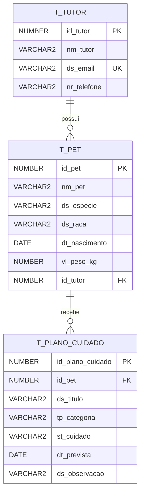

# Modelagem relacional

## Modelo descritivo

A solucao Clyvo Vet registra responsaveis por pets, os pets vinculados a cada tutor e os planos de cuidado que representam a continuidade da jornada clinica. O modelo esta em 3FN: dados de tutor, pet e planos ficam em tabelas distintas, sem repeticao de grupos, com dependencias funcionais diretas das chaves primarias.

## Entidades e relacionamentos

## Constraints principais

- `T_TUTOR.ds_email` e unico para evitar cadastro duplicado do responsavel.
- `T_PET.id_tutor` e chave estrangeira obrigatoria para `T_TUTOR`.
- `T_PLANO_CUIDADO.id_pet` e chave estrangeira obrigatoria para `T_PET`.
- `T_PLANO_CUIDADO.tp_categoria` aceita apenas categorias da API Java.
- `T_PLANO_CUIDADO.st_cuidado` aceita apenas status da API Java.
- `T_LOG_ERRO` guarda procedure, usuario, data, codigo e mensagem de erro para as cargas.

## Arquivos SQL

- `sql/01_schema_oracle.sql`: DDL do modelo fisico Oracle.
- `sql/02_procedures_seed.sql`: procedures parametrizadas e carga inicial.
- `sql/03_reports_oracle.sql`: blocos anonimos, joins, LAG/LEAD e relatorios com cursor explicito.
